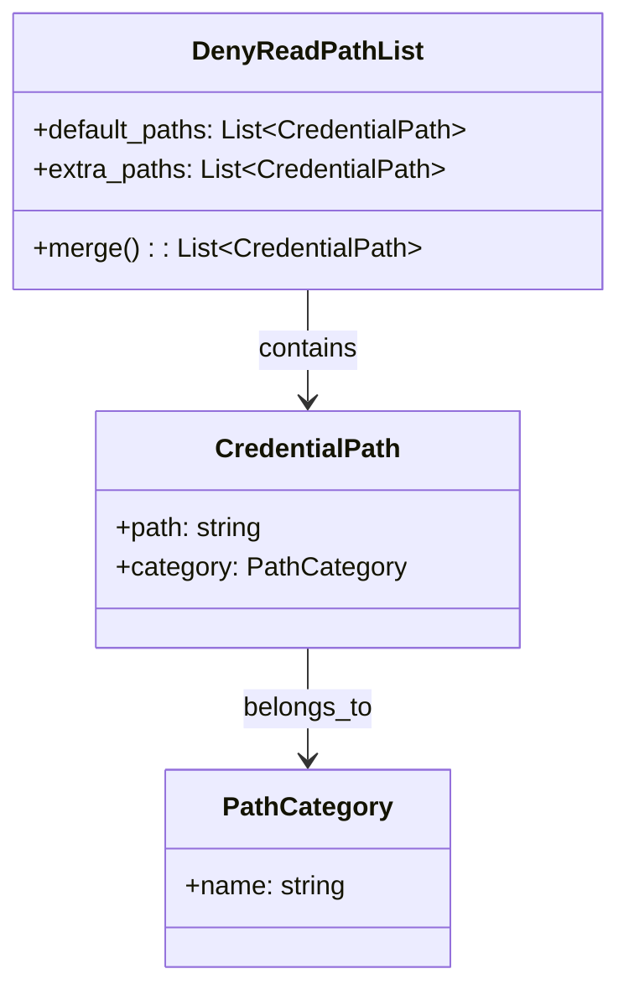

# ドメインモデル: deny-read パス拡充

## 概要
サンドボックスのデフォルトdeny-readパスリストに主要クラウドサービス・開発ツールのクレデンシャルパスを追加する。

## エンティティ（Entity）

### DenyReadPathList
- **属性**:
  - default_paths: List<Path> - ハードコードされたデフォルトdeny-readパス（現在4件→21件に拡張）
  - extra_paths: List<Path> - ユーザー設定（SANDBOX_EXTRA_DENY_READ）から追加されるパス
- **振る舞い**:
  - merge(): default_pathsとextra_pathsを結合して最終リストを返す
  - resolve_home(path): `~`プレフィックスを$HOMEに展開

## 値オブジェクト（Value Object）

### CredentialPath
- **属性**: path: string - クレデンシャルが格納されるディレクトリパス
- **不変性**: パスは実行時に決定され、以降変更されない
- **等価性**: パス文字列の完全一致

### PathCategory
- **属性**: name: string - カテゴリ名（cloud/container/cdn/iac/devtools）
- **不変性**: カテゴリは固定
- **等価性**: カテゴリ名の完全一致

## ドメインモデル図

## ユビキタス言語

- **deny-read**: サンドボックス内のプロセスからの読み取りをカーネルレベルで拒否するパス
- **InaccessiblePaths**: Linux systemd-runで特定パスへのアクセスを完全遮断するプロパティ
- **subpath**: Seatbeltプロファイルでディレクトリ配下の全ファイルに適用するフィルタ
